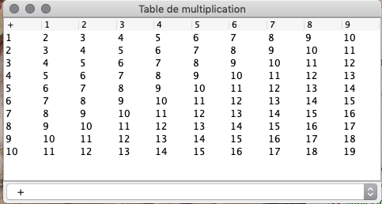
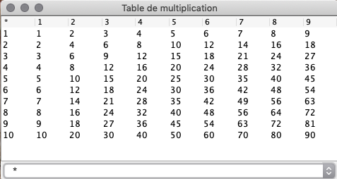

# NFA035 - session de juin 2021

Comme les précédents devoirs, ce devoir doit être rendu en passant par l'outil intégré.
À la différence des devoirs normaux, nous ne faisons pas de test automatiques lors du rendu. Vous 
aurez normalement la réponse 

~~~
TP 004

nombre de tests 1
nombre d'échecs 0

Tous les tests passent !!!
~~~

Quel que soit votre code. À vous de bien le vérifier, dans tous les cas !

## Exercice 1

Dans un jeu, le personnage dispose d'un *inventaire* dans lequel il peut ajouter des objets (qu'on appellera ici *items*, parce que le terme *objet* serait un peu ambigu).

Un *item* a un nom, et un poids. Par exemple, l'item "bois" a un poids de 5. Pour éviter les incohérences, on suppose qu'on ne créera qu'une seule instance pour un type d'item donné.

L'inventaire ne crée pas d'items ; il se contente de les enregistrer. Un item peut être possédé en plusieurs exemplaires. Pour représenter cela, on représente l'inventaire comme une *map*, avec comme clefs les items et comme valeurs, le nombre de fois où on les trouve.

## Question 1

Chaque item a un poids. Écrire la méthode `getPoidsTotal()` de la classe `Inventaire`. Par exemple, si 
je transporte 2 unités de bois pesant 5, et une unité d'or pesant 1, la méthode `getPoidsTotal()` doit renvoyer 11.

## Question 2

Complétez la méthode `ajouter` de la classe `Inventaire` en respectant ses spécifications. Pensez bien en particulier à la limite totale du poids.

## Question 3

Écrivez un test pour vérifier que votre méthode fait bien ce qui est demandé quand on dépasse le poids de 200 :

- l'ajout ne doit rien faire (l'inventaire reste inchangé) ;
- la méthode doit renvoyer `false`

P.S. : on aurait pu utiliser une exception au lieu d'un booléen. Nous ne le faisons pas pour vous simplifier l'écriture du test.

## Question 4

Le personnage du joueur peut apprendre des *recettes* qui lui permettent de créer de nouveaux objets à partir de son inventaire. On ne s'intéressera pas ici à la manière dont il les apprend, mais simplement aux recettes elles-même.

Une recette *consomme* un certain nombre d'ingrédients, et ajoute un nouvel item à l'inventaire. **Remarque** : dans le *monde* du jeu,
le joueur aura l'impression qu'un nouvel item a effectivement été créé ; dans la "réalité" informatique, il n'y aura pas vraiment de création d'objet java, mais une simple modification de l'inventaire.

Par exemple, dans les tests, nous vous proposons un scénario où on construit un bouclier. Le bouclier est défini comme utilisant :
- 2 ingrédients "bois" ;
- 1 ingrédient "métal".

On a le choix de l'endroit où placer la méthode qui "exécute" une recette, 
mais le plus logique est de la placer dans la recette elle-même. Dans ce cas, la *recette* doit
recevoir comme argument l'inventaire de l'utilisateur, pour pouvoir le consulter et le modifier.

Si j'appelle :

~~~
boolean ok = recetteBouclier.appliquer(inventaire);
~~~

- si certains ingrédients manquent, l'application échoue, l'inventaire n'est pas modifié ;
- si tous les ingrédients sont disponibles, on va :
    1. retirer les ingrédients utilisés par la recette de l'inventaire ;
    2. ajouter l'objet créé par la recette à l'inventaire.

La lecture du test `testRecetteBouclier` vous montrera comment doit fonctionner la méthode.

**CONSEIL** : travaillez en deux temps : vérifiez d'abord que les ingrédients sont disponibles (vous pouvez même en faire une méthode annexe), en ensuite 
appliquez la recette.

## Exercice 2

### Question 1

On désire formater un texte pour qu'il tienne sur *tailleLigne* caractères de large.

La méthode utilisée est de renvoyer à la ligne le contenu qui dépasse. Une ligne du texte d'entrée peut alors 
être réécrite comme *plusieurs* lignes du texte de sortie.

Par exemple, si *tailleLigne* vaut 9, le texte en entrée :

~~~
123456789
un exemple de texte pour voir
comment ça
se passe
~~~

Donnera en sortie :

~~~
123456789
un exempl
e de text
e pour vo
ir
comment ç
a
se passe
~~~

(la ligne avec des chiffres est là pour vous aider à comprendre).

Écrire la méthode `ExoFichier.passerALaLigne`.

Remarque : pour cet exercice, vous pouvez supposer (en particulier en sortie) que toutes les lignes se terminent par `\n`.

### Question 2

Pour publiposter une lettre on a défini un format où on écrit un simple fichier texte comme modèle. Le nom du destinataire est indiqué par `@N` dans ce modèle. La fonction `copierLettre` prend comme argument un nom à utiliser comme valeur de remplacement.
Toutes les occurrences de  `@N` devront être remplacées par le nom.

Par exemple, si le modèle désigné par *reader* est :

~~~
Bonjour @N, comment
ça va ?
~~~

et qu'on appelle
~~~java
ExoFichier.copierLettre(reader, writer, "Babbage");
~~~

Le résultat attendu est un fichier contenant :

~~~
Bonjour Babbage, comment
ça va ?
~~~

## Exercice 3

On souhaite créer un petit programme permettant d'afficher dans une `JTable` soit une table d'addition, soit une table de multiplications. La table à afficher sera choisie par une liste déroulante.

Exemple pour l'addition :

Exemple pour la multiplication :

Complétez le code fourni pour obtenir un affichage correct quand on sélectionne l'une des deux opérations.
Notez que vous pouvez, au choix :

- utiliser et adapter le TableModel qui vous est fourni ; notez qu'il dispose d'une méthode `setOperation` qui permet de choisir l'opération dont la table est affichée ;

- travailler directement avec un `DefaultTableModel` (ce qui n'est pas forcément plus simple).

- créer un `TableModel` pour chacune des deux opérations, et changer de `TableModel` à la demande.

En théorie, vous aurez à modifier :

- la classe `TableOperationApp`, en lui ajoutant éventuellement une ou plusieurs méthodes ;
- la classe `OperationTableModele`, si vous décidez de choisir la première approche que nous proposons.

### Indications

Le `JComboBox` est une liste déroulante. Nous y avons placé, sous forme d'une String, le nom de l'opération dont on veut la table. Tel qu'il est utilisé, deux méthodes vous intéressent :

- `addActionListener` : un `ActionListener` est appelé chaque fois qu'on sélectionne une des deux entrées de la liste. 
- `getSelectedItem()` : retourne l'entrée sélectionnée. Ici, ce sera l'un des deux labels (`*` ou `+`), sous forme de `String`. Le type de retour est `Object`, ce qui signifie qu'il faudra probablement faire un `cast`.

